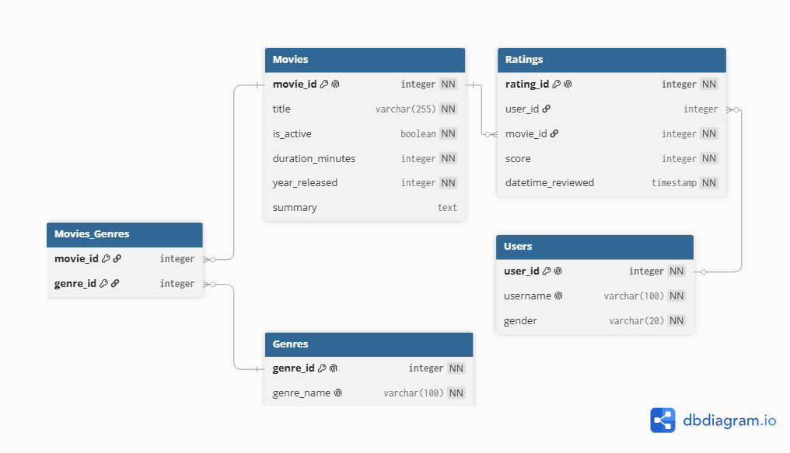

# Movie Rating Database
Theme: Movies

Summary: The purpose of this database is to organize movie and user rating information for analysis purposes. 

The database stores movies, users, ratings, and genres information. Users submit ratings for movies. Each rating records the user, movie, and score data. Movies connect to genres through the junction table movie_genre so that each movie can be associated with multiple genres and each genre can have many movies associated with it. This allows the database to keep the rating and movie data organized. 

The database should be able to answer questions such as which movie has the highest average rating score, how many ratings each movie receives, and how many movies are released each year. This database can also be used to determine whether there is a relationship between a user’s gender and the genres of the movies they rated, and whether longer movies tend to receive higher or lower scores. These questions help analyze movie preferences and understand patterns in movie ratings. 

### Entity Relationship Diagram (ERD)
